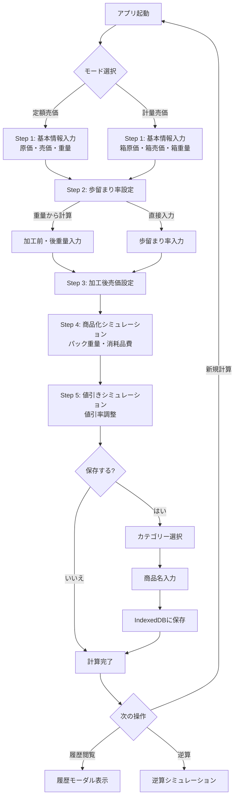
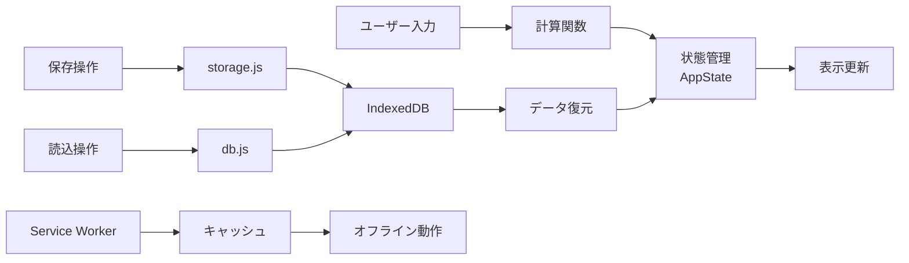

# 歩留まり計算ツール 🧮

食品加工業向けの歩留まり率・原価・売価・値入率を計算するWebアプリケーションです。

[](https://web.dev/progressive-web-apps/)
[](https://web.dev/offline-first/)
[](https://search.google.com/test/mobile-friendly)

## 目次
- [主な機能](#-主な機能)
- [フローチャート](#-フローチャート)
- [使い方](#-使い方)
- [PWAとしてインストール](#pwaとしてインストール)
- [プロジェクト構成](#-プロジェクト構成)
- [技術スタック](#-技術スタック)
- [設計のポイント](#-設計のポイント)
- [ドキュメント](#-ドキュメント)
- [今後の拡張案](#-今後の拡張案)

## ✨ 主な機能

### 📊 計算機能
- **2つの計算モード**
  - 定額売価→計量加工（箱単位仕入れ、100g単位販売）
  - 計量売価→計量加工（100g単位仕入れ、100g単位販売）
- **ステップ式の段階的計算**: 各ステップで結果を確認しながら進行
- **リアルタイム計算**: 入力時に即座に結果を表示
- **歩留まり率の計算方法選択**
  - 重量から計算（実測値から自動計算）
  - 歩留まり率直接入力

### 🎯 シミュレーション機能
- **商品化シミュレーション**: パック化後の原価・売価・値入率を計算
- **値引きシミュレーション**: 値引率に応じた粗利率を計算
- **逆算シミュレーション**: 目標値入率から必要な値を逆算
  - 重量、売価、消耗品費、歩留まり率、値引率の逆算に対応
  - エラー時は具体的なガイダンスを表示

### 💾 データ管理
- **完全オフライン動作**: IndexedDBによるローカル保存
- **履歴管理**
  - 計算結果の保存（商品名・カテゴリー別）
  - カテゴリー優先の保存フロー
  - カテゴリー別フィルタリング
  - 同一商品名の履歴をスワイプで切り替え
- **詳細な履歴表示**
  - 原価、売価、加工前値入率、加工後値入率
  - 歩留まり率、最終粗利率（値引後）
  - モード表示（定額売価/計量売価）
- **データエクスポート/インポート**: JSON形式でバックアップ・復元

### 📱 PWA対応
- **ホーム画面に追加可能**: スマホアプリのように使用
- **オフライン動作**: ネット接続不要
- **自動更新通知**: 新バージョンが利用可能な場合に通知
- **キャッシュ最適化**: 高速な起動と動作

### 🎨 UI/UX
- **モバイル最適化**: タッチ操作に最適化
- **スワイプUI**: 同一商品名の履歴を横スワイプで閲覧
- **トースト通知**: 操作結果をわかりやすく通知
- **アニメーション効果**: 直感的な操作フィードバック

## 📊 フローチャート

### ユーザー操作フロー



### データフロー



## 🚀 使い方

### 基本的な流れ

1. **モード選択**
   - 「定額売価→計量加工」または「計量売価→計量加工」を選択

2. **Step 1: 基本情報**
   - 原価・売価・重量を入力
   - 加工前の100gあたり原価・売価・値入率が表示

3. **Step 2: 歩留まり率の設定**
   - 「重量から計算」: 加工前後の重量を入力
   - 「歩留まり率直接入力」: 歩留まり率を直接入力

4. **Step 3: 加工後の売価設定**
   - 加工後の100gあたり売価を入力
   - 加工後の原価・売価・値入率が表示

5. **Step 4: 商品化シミュレーション**
   - 1パックの重量と消耗品費を入力
   - 商品化後の原価・売価・値入率を確認

6. **Step 5: 値引きシミュレーション**
   - 値引率をスライダーで調整
   - 値引き後の粗利率を確認

### データ保存・履歴管理

#### 保存方法
1. 計算完了後、**「💾 この計算を保存」**ボタンをクリック
2. **カテゴリーを選択**（野菜/果実）
3. **商品名を入力**（カテゴリーに応じた商品名候補が表示）
4. **「保存」**をクリック

#### 履歴の閲覧
1. 「📦 基本情報」セクションの**「📂 履歴」**ボタンをクリック
2. 保存済みの計算一覧が表示
3. 同一商品名が複数ある場合は、横スワイプで切り替え
4. インジケーターで現在位置を確認
5. モードラベル（定額売価/計量売価）が品名の左側に表示

#### 履歴の操作
- **📂 読込**: 保存した計算を復元（全ステップの結果を即座に表示）
- **✏️ 編集**: 商品名・カテゴリーを変更
- **🗑️ 削除**: 不要なデータを削除
- **検索**: 商品名で絞り込み
- **エクスポート**: JSONファイルとしてバックアップ
- **インポート**: 別端末でJSONファイルを復元
- **クリア**: 「💾 この計算を保存」ボタンの隣にある「クリア」ボタンで全入力をリセット

### PWAとしてインストール

#### スマホ（Android）
1. Chromeでアクセス
2. メニュー → **「ホーム画面に追加」**

#### スマホ（iOS）
1. Safariでアクセス
2. 共有ボタン → **「ホーム画面に追加」**

#### PC
1. Chrome/Edgeでアクセス
2. アドレスバー右側の**インストールアイコン**をクリック

## 📁 プロジェクト構成

```
yield-calculator/
├── index.html              # メインHTML
├── manifest.json           # PWA設定
├── sw.js                   # Service Worker
├── icons/                  # アプリアイコン
├── scripts/
│   ├── main.js            # エントリーポイント
│   ├── constants.js       # 定数定義
│   ├── state.js           # 状態管理
│   ├── calculation.js     # 計算関数
│   ├── calculator-fixed.js    # 定額モード計算
│   ├── calculator-weight.js   # 計量モード計算
│   ├── display.js         # 表示処理
│   ├── input-handler.js   # 入力管理
│   ├── product-simulator.js  # シミュレーション
│   ├── db.js              # IndexedDB管理
│   ├── storage.js         # データ保存ロジック
│   ├── history-ui.js      # 履歴UI管理
│   └── dom-utils.js       # DOMユーティリティ
└── styles/
    ├── main.css           # メインスタイル
    └── history.css        # 履歴UIスタイル
```

## 🔧 技術スタック

- **HTML5**: セマンティックなマークアップ
- **CSS3**: カスタムプロパティ、Flexbox、Grid、アニメーション
- **JavaScript (ES6+)**: モジュール、Promise、async/await
- **IndexedDB**: ローカルデータベース
- **Service Worker**: オフライン対応、キャッシュ管理
- **PWA**: Progressive Web App対応

## 🎓 設計のポイント

### アーキテクチャ
- **モジュール化**: 責務ごとにファイルを分割（14ファイル）
- **状態管理**: Stateクラスで一元管理
- **定数化**: UI要素IDや計算定数を一箇所で管理
- **純粋関数**: 副作用のない計算関数
- **オフラインファースト**: ネット接続不要で動作

### ユーザーエクスペリエンス
- **段階的表示**: ステップごとに進行を確認
- **即座のフィードバック**: 入力時にリアルタイム計算
- **エラーガイド**: 具体的なエラーメッセージで問題解決を支援
- **逆算機能**: 目標から必要条件を導出
- **スワイプUI**: 直感的な履歴閲覧

### コード品質
- **DRY原則**: 重複コードの排除
- **単一責任**: 各モジュールが明確な役割を持つ
- **拡張性**: 新機能の追加が容易な設計

## 📊 データ管理

- **保存先**: IndexedDB（ブラウザのローカルストレージ）
- **容量**: 約10,000件の計算を保存可能
- **プライバシー**: データが外部に送信されない
- **バックアップ**: JSON形式でエクスポート可能

## 🔜 今後の拡張案

- クラウド同期（Firebase/Supabase）
- グラフ表示（Chart.js）
- PDF出力（jsPDF）
- カメラ入力（OCR）
- 統計ダッシュボード

## 📝 ドキュメント

### ユーザー向け
- [README.md](./README.md) - このファイル（使い方ガイド）
- [CHANGELOG.md](./CHANGELOG.md) - 変更履歴

### 開発者向け
- [docs/ARCHITECTURE.md](./docs/ARCHITECTURE.md) - アーキテクチャ設計、フローチャート詳細
- [docs/FEATURES.md](./docs/FEATURES.md) - 機能詳細仕様
- [docs/reverse-sim-spec.md](./docs/reverse-sim-spec.md) - 逆算シミュレーション仕様
- [MVP_IMPLEMENTATION.md](./MVP_IMPLEMENTATION.md) - MVP実装の詳細、開発ガイド

## 🐛 問題が発生した場合

1. DevToolsのConsoleでエラーを確認
2. Application タブで IndexedDB/Service Worker の状態を確認
3. ハードリロード（Ctrl+Shift+R / Cmd+Shift+R）
4. キャッシュとCookieをクリア

## 📄 ライセンス

このプロジェクトはリファクタリングと学習目的で作成されました。

---

**バージョン**: v3.4
**最終更新**: 2025-01-26
**開発**: Claude Code

## 📝 最近の更新内容

### v3.4 (2025-01-26)
- **計算式ヘルプアイコンの動作改善**: PCとスマホでの動作を修正
  - PCでホバー: ブラウザネイティブのツールチップで簡単な説明
  - PCでクリック: 詳細な計算式をモーダルで表示
  - スマホでタップ: 詳細な計算式をモーダルで表示
- **許容誤差と信頼水準のヘルプ追加**: 統計分析項目の詳細な説明をモーダルで表示可能に
- **ツールチップ表示の改善**: カスタムCSSを削除し、ブラウザネイティブのツールチップに統一

### v3.3 (2025-01-26)
- ドキュメント整備：READMEにフローチャート追加（ユーザー操作フロー、データフロー）
- 新規ドキュメント作成：`docs/ARCHITECTURE.md`（アーキテクチャ設計、各種フローチャート）
- ドキュメント構造改善：ユーザー向けと開発者向けに分類
- 各ドキュメント間の相互リンク強化
- **PWA自動更新の改善**：Service Workerのバージョンを自動管理（GitHub Actions利用）
  - デプロイ時に自動的にタイムスタンプとコミットハッシュを注入
  - 手動でのバージョン更新が不要に

### v3.2 (2025-01-25)
- 履歴表示を改善：加工前値入率と加工後値入率を分けて表示
- モードラベルを「定額売価」「計量売価」に変更
- 履歴ボタンを基本情報セクションのヘッダーに配置
- クリアボタンを保存ボタンの隣に配置
- 履歴読み込み時の結果表示を改善（即座に全結果を表示）
- 履歴モーダルのサイズを拡大（98%幅、95vh高さ）
