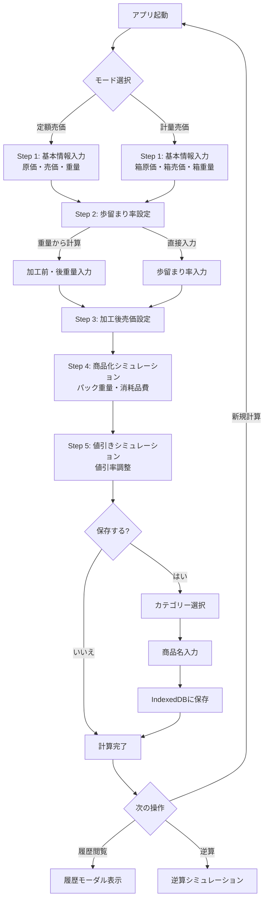
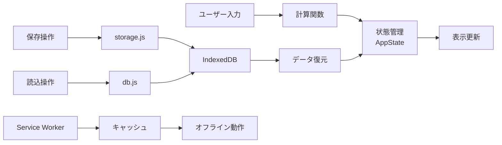

# 歩留まり計算ツール 🧮

食品加工業向けの歩留まり率・原価・売価・値入率を計算するWebアプリケーションです。

[](https://web.dev/progressive-web-apps/)
[](https://web.dev/offline-first/)
[](https://search.google.com/test/mobile-friendly)

## 目次
- [主な機能](#-主な機能)
- [フローチャート](#-フローチャート)
- [使い方](#-使い方)
- [PWAとしてインストール](#pwaとしてインストール)
- [プロジェクト構成](#-プロジェクト構成)
- [技術スタック](#-技術スタック)
- [設計のポイント](#-設計のポイント)
- [ドキュメント](#-ドキュメント)
- [今後の拡張案](#-今後の拡張案)

## ✨ 主な機能

### 📊 計算機能
- **4つの計算モード**
  - 定額売価→計量加工（箱単位仕入れ、100g単位販売）
  - 計量売価→計量加工（100g単位仕入れ、100g単位販売）
  - **歩留まり統計（複数サンプルの統計分析）**
  - **複数パターン分析（原価・売価の複数シナリオ比較）** 🆕
- **ステップ式の段階的計算**: 各ステップで結果を確認しながら進行
- **リアルタイム計算**: 入力時に即座に結果を表示
- **歩留まり率の計算方法選択**
  - 重量から計算（実測値から自動計算）
  - 歩留まり率直接入力

### 📈 歩留まり統計モード（Phase 9: UX改善完了）
- **Excel風データテーブル**: 加工前後の重量を表形式で入力
- **自動統計分析**: データ入力後、即座に統計分析を実行
- **🎬 アニメーション効果**: フェードイン、スライドアップ、スケールインで視覚的フィードバック
- **🎨 カラーコーディング**: 緑（良好）、黄（警告）、赤（危険）で直感的な評価表示
- **📈 プログレスバー**: サンプルサイズの充足度を視覚化
- **⏱️ カウントアップ効果**: 数値が段階的にアニメーション表示
- **基本統計量**
  - データ数、最大値、最小値、範囲
  - 平均値、中央値、標準偏差、変動係数（CV）
- **四分位数と分布**
  - 第1四分位数（Q1）、第3四分位数（Q3）、四分位範囲（IQR）
  - 歪度（Skewness）、尖度（Kurtosis）
- **信頼区間分析**
  - σ1範囲（68.3%）、σ2範囲（95.4%）、σ3範囲（99.7%）
  - 正規分布に基づく信頼区間を表示
- **📊 z-score判定システム**（v4.1で追加） 🆕
  - 個別データポイントの統計的評価を実現
  - **計算式**: z = (個別値 - 平均) / 標準偏差
  - **判定基準**:
    - |z| ≤ 1: ✓ 非常に良好（68.3%範囲内）
    - |z| ≤ 2: ○ 良好（95.4%範囲内）
    - |z| ≤ 3: △ 注意（99.7%範囲内）
    - |z| > 3: × 外れ値の可能性（0.3%未満）
  - データのばらつき（標準偏差）を考慮した統計的に正しい判定
  - ?アイコンクリックで詳細な説明をモーダル表示
- **サンプルサイズ妥当性判断**
  - 許容誤差と信頼水準を設定
  - 必要サンプル数を自動計算
  - 実際のサンプル数と比較して妥当性を判定
- **外れ値検出（IQR法）**
  - 外れ値を自動検出して視覚的にハイライト
  - 外れ値を選択して削除可能
  - 外れ値の影響を確認できる
- **推奨代表値**
  - データの分布形状から適切な代表値（平均値 or 中央値）を推奨
  - 歪度に基づく自動判定
- **グラフ表示（ECharts使用）**
  - 箱ひげ図：データの分布を視覚化
  - ヒストグラム：度数分布を確認
  - 散布図：データの傾向を把握
  - 正規分布曲線：理論分布との比較
  - Q-Qプロット：正規性の検定
- **分析対象の切り替え**
  - 歩留まり率、加工前重量、加工後重量の統計を切り替え表示

### 📊 複数パターン分析モード 🆕
- **複数シナリオの一括比較**: 異なる原価・売価パターンを同時に分析
- **プリセット管理機能**
  - よく使う原価・売価の組み合わせをプリセットとして保存
  - プリセット名、カテゴリー、メモを管理
  - プリセットから選択して一括入力
  - プリセットの編集・削除・エクスポート/インポート
- **統計値の自動読み込み**: 歩留まり統計の結果（平均値・中央値）を自動入力
- **比較表示**: 各パターンの値入率、粗利額を一覧表示
- **最適パターンの特定**: 最も収益性の高いシナリオを可視化

### 🎯 シミュレーション機能
- **商品化シミュレーション**: パック化後の原価・売価・値入率を計算
- **値引きシミュレーション**: 値引率に応じた粗利率を計算
- **逆算シミュレーション**: 目標値入率から必要な値を逆算
  - 重量、売価、消耗品費、歩留まり率、値引率の逆算に対応
  - エラー時は具体的なガイダンスを表示

### 💾 データ管理
- **完全オフライン動作**: IndexedDBによるローカル保存
- **履歴管理**
  - 計算結果の保存（商品名・カテゴリー別）
  - カテゴリー優先の保存フロー
  - カテゴリー別フィルタリング
  - 同一商品名の履歴をスワイプで切り替え
- **詳細な履歴表示**
  - 原価、売価、加工前値入率、加工後値入率
  - 歩留まり率、最終粗利率（値引後）
  - モード表示（定額売価/計量売価）
- **データエクスポート/インポート**: JSON形式でバックアップ・復元

### 📱 PWA対応
- **ホーム画面に追加可能**: スマホアプリのように使用
- **オフライン動作**: ネット接続不要
- **自動更新通知**: 新バージョンが利用可能な場合に通知
- **キャッシュ最適化**: 高速な起動と動作

### 🎨 UI/UX
- **モバイル最適化**: タッチ操作に最適化
- **スワイプUI**: 同一商品名の履歴を横スワイプで閲覧
- **トースト通知**: 操作結果をわかりやすく通知
- **アニメーション効果**: 直感的な操作フィードバック

## 📊 フローチャート

### ユーザー操作フロー



### データフロー



## 🚀 使い方

### 基本的な流れ

1. **モード選択**
   - 「定額売価→計量加工」「計量売価→計量加工」「歩留まり統計」から選択

2. **Step 1: 基本情報**
   - 原価・売価・重量を入力
   - 加工前の100gあたり原価・売価・値入率が表示

3. **Step 2: 歩留まり率の設定**
   - 「重量から計算」: 加工前後の重量を入力
   - 「歩留まり率直接入力」: 歩留まり率を直接入力

4. **Step 3: 加工後の売価設定**
   - 加工後の100gあたり売価を入力
   - 加工後の原価・売価・値入率が表示

5. **Step 4: 商品化シミュレーション**
   - 1パックの重量と消耗品費を入力
   - 商品化後の原価・売価・値入率を確認

6. **Step 5: 値引きシミュレーション**
   - 値引率をスライダーで調整
   - 値引き後の粗利率を確認

### 歩留まり統計モードの使い方

1. **品名入力**
   - 分析する商品名を入力（例: トマト）

2. **データ入力**
   - Excel風のテーブルに加工前重量と加工後重量を入力
   - 歩留まり率が自動計算される
   - 最低2件以上のデータが必要

3. **統計分析の確認**
   - 基本統計量：平均値、中央値、標準偏差など
   - 四分位数：Q1、Q3、IQR
   - 分布の形状：歪度、尖度
   - 信頼区間：σ1、σ2、σ3範囲

4. **サンプルサイズの妥当性判断**
   - 許容誤差（E）を入力（例: 2.0%）
   - 信頼水準を選択（90%、95%、99%）
   - 必要サンプル数が自動計算される
   - 実際のサンプル数と比較して妥当性を判定

5. **外れ値の確認と削除**
   - IQR法により外れ値を自動検出
   - テーブル上で外れ値がハイライト表示
   - 外れ値を選択して削除可能
   - 削除後に統計が再計算される

6. **推奨代表値の確認**
   - データの歪度から適切な代表値（平均値 or 中央値）を推奨
   - 歪度が小さい→平均値を使用
   - 歪度が大きい→中央値を使用

7. **グラフ表示**
   - 表示する統計を選択（歩留まり率、加工前重量、加工後重量）
   - グラフ種類を選択（箱ひげ図、ヒストグラム、散布図、正規分布曲線、Q-Qプロット）
   - データの分布を視覚的に確認

8. **ヘルプ機能**
   - 各統計項目の隣にある?マークをクリック/タップ
   - 計算式と詳細な説明がモーダルで表示される

### セッション管理

#### 自動保存機能
- **入力値の自動保持**: ページをリロードしても入力値が保持されます
- **有効期限**: 24時間でセッションデータが自動削除されます
- **対応内容**: すべての入力フィールド、選択中のモード、計算方法

### データ保存・履歴管理

#### 保存方法
1. 計算完了後、**「💾 この計算を保存」**ボタンをクリック
2. **カテゴリーを選択**（野菜/果実）
3. **商品名を入力**（カテゴリーに応じた商品名候補が表示）
4. **「保存」**をクリック

**注意**: 履歴から読み込んだ計算は、変更がない場合は保存ボタンが無効化されます。

#### 履歴の閲覧
1. 「📦 基本情報」セクションの**「📂 履歴」**ボタンをクリック
2. 保存済みの計算一覧が表示
3. 同一商品名が複数ある場合は、横スワイプで切り替え
4. インジケーターで現在位置を確認
5. モードラベル（定額売価/計量売価）が品名の左側に表示

#### 履歴の操作
- **📂 読込**: 保存した計算を復元（全ステップの結果を即座に表示）
- **✏️ 編集**: 商品名・カテゴリーを変更
- **🗑️ 削除**: 不要なデータを削除
- **検索**: 商品名で絞り込み
- **エクスポート**: JSONファイルとしてバックアップ
- **インポート**: 別端末でJSONファイルを復元
- **クリア**: 「💾 この計算を保存」ボタンの隣にある「クリア」ボタンで全入力をリセット

### PWAとしてインストール

#### スマホ（Android）
1. Chromeでアクセス
2. メニュー → **「ホーム画面に追加」**

#### スマホ（iOS）
1. Safariでアクセス
2. 共有ボタン → **「ホーム画面に追加」**

#### PC
1. Chrome/Edgeでアクセス
2. アドレスバー右側の**インストールアイコン**をクリック

## 📁 プロジェクト構成

**Phase 9リファクタリング完了**: モノリシックな構造から35モジュールの高度にモジュール化されたアーキテクチャへ

```
yield-calculator/
├── index.html              # メインHTML
├── manifest.json           # PWA設定
├── sw.js                   # Service Worker
├── icons/                  # アプリアイコン
├── scripts/ (35モジュール)
│   ├── main.js            # エントリーポイント（15行、99.7%削減）
│   ├── constants.js       # 定数定義
│   ├── state.js           # 状態管理
│   │
│   ├── 計算モジュール（5ファイル）
│   ├── calculation.js     # 共通計算関数
│   ├── calculator-fixed.js        # 定額モード計算
│   ├── calculator-weight.js       # 計量モード計算
│   ├── calculator-yield-stats.js  # 歩留まり統計計算
│   └── calculator-multi-pattern.js # 複数パターン分析 🆕
│   │
│   ├── UI/表示モジュール（8ファイル）
│   ├── display.js         # 表示処理
│   ├── dom-utils.js       # DOMユーティリティ
│   ├── form-manager.js    # フォーム管理
│   ├── mode-manager.js    # モード切替管理
│   ├── multi-pattern-ui.js # 複数パターンUI 🆕
│   ├── outlier-management.js # 外れ値UI（Phase 9）
│   ├── sample-size-validator.js # サンプルサイズ検証UI（Phase 9）
│   └── stats-ui-helpers.js # 統計UI補助（Phase 9）
│   │
│   ├── 歩留まり統計モジュール（7ファイル）
│   ├── yield-stats-calc.js     # 統計計算
│   ├── yield-stats-charts.js   # グラフ描画
│   ├── yield-stats-display.js  # 統計表示（Phase 9 UX改善）
│   ├── yield-stats-helpers.js  # 統計ヘルパー
│   ├── yield-stats-table.js    # データテーブル
│   ├── multi-pattern-stats-loader.js # 統計値読み込み 🆕
│   └── multi-pattern-presets.js # プリセット管理 🆕
│   │
│   ├── 履歴管理モジュール（5ファイル）
│   ├── history-ui.js      # 履歴UI管理
│   ├── history-item-renderer.js # 履歴項目描画
│   ├── history-restore.js # 履歴復元
│   ├── history-save-dialog.js # 保存ダイアログ
│   └── history-ui-controls.js # 履歴操作
│   │
│   ├── データ管理モジュール（3ファイル）
│   ├── db.js              # IndexedDB管理
│   ├── storage.js         # データ保存ロジック
│   └── session.js         # セッション状態管理
│   │
│   ├── イベント管理モジュール（2ファイル）
│   ├── event-handlers-setup.js # イベントリスナー設定
│   └── input-handler.js   # 入力ハンドラー
│   │
│   └── シミュレーションモジュール（1ファイル）
│       └── product-simulator.js  # 商品化/値引き/逆算
│
├── styles/
│   ├── main.css           # メインスタイル
│   └── history.css        # 履歴UIスタイル
│
└── docs/                  # ドキュメント
    ├── ARCHITECTURE.md    # アーキテクチャ設計
    ├── FEATURES.md        # 機能詳細仕様
    ├── TEST_PLAN_PHASE9.md # Phase 9テスト計画
    ├── QUICK_TEST_GUIDE.md # クイックテストガイド
    └── CACHE_CLEAR_GUIDE.md # キャッシュクリアガイド
```

## 🔧 技術スタック

- **HTML5**: セマンティックなマークアップ
- **CSS3**: カスタムプロパティ、Flexbox、Grid、アニメーション
- **JavaScript (ES6+)**: モジュール、Promise、async/await
- **IndexedDB**: ローカルデータベース
- **Service Worker**: オフライン対応、キャッシュ管理
- **PWA**: Progressive Web App対応
- **ECharts**: データ可視化ライブラリ（統計グラフ表示）

## 🎓 設計のポイント

### アーキテクチャ（Phase 9完了）
- **高度なモジュール化**: 責務ごとに細分化（35モジュール）
  - main.js: 5,621行 → 15行（99.7%削減）
  - 単一責任の原則を徹底
  - 疎結合な設計で保守性向上
- **状態管理**: AppStateクラスで一元管理
  - セッション状態、履歴状態、統計状態を統合
  - フラグベースのシンプルなロジック
- **定数化**: UI要素IDや計算定数を一箇所で管理
- **純粋関数**: 副作用のない計算関数（calculation.js, yield-stats-calc.js）
- **オフラインファースト**: ネット接続不要で動作
- **プリセット機能**: 再利用可能なデータパターン管理

### ユーザーエクスペリエンス（Phase 9: UX改善）
- **段階的表示**: ステップごとに進行を確認
- **即座のフィードバック**: 入力時にリアルタイム計算
- **🎬 アニメーション**: fadeIn, fadeInUp, scaleInで視覚的フィードバック
- **🎨 カラーコーディング**: 緑（良好）、黄（警告）、赤（危険）で状態を直感的に表示
- **📈 プログレスバー**: サンプルサイズ充足度の視覚化
- **⏱️ カウントアップ効果**: 統計値が段階的にアニメーション表示
- **📊 アイコン付き表示**: 視覚的な情報伝達（🌟✓⚡⚠️📊📈）
- **エラーガイド**: 具体的なエラーメッセージで問題解決を支援
- **逆算機能**: 目標から必要条件を導出
- **スワイプUI**: 直感的な履歴閲覧

### コード品質
- **DRY原則**: 重複コードの排除
- **単一責任**: 各モジュールが明確な役割を持つ
- **拡張性**: 新機能の追加が容易な設計

## 📊 データ管理

- **保存先**: IndexedDB（ブラウザのローカルストレージ）
- **容量**: 約10,000件の計算を保存可能
- **プライバシー**: データが外部に送信されない
- **バックアップ**: JSON形式でエクスポート可能

## 🔜 今後の拡張案

- クラウド同期（Firebase/Supabase）
- PDF出力（jsPDF）
- カメラ入力（OCR）
- 歩留まり統計の保存・履歴管理
- カスタムレポート生成

## 📝 ドキュメント

### ユーザー向け
- [README.md](./README.md) - このファイル（使い方ガイド）
- [CHANGELOG.md](./CHANGELOG.md) - 変更履歴
- [QUICK_TEST_GUIDE.md](./QUICK_TEST_GUIDE.md) - クイックテストガイド（1分で機能確認）
- [CACHE_CLEAR_GUIDE.md](./CACHE_CLEAR_GUIDE.md) - ブラウザキャッシュクリア方法

### 開発者向け
- [docs/ARCHITECTURE.md](./docs/ARCHITECTURE.md) - アーキテクチャ設計、フローチャート詳細
- [docs/FEATURES.md](./docs/FEATURES.md) - 機能詳細仕様
- [docs/reverse-sim-spec.md](./docs/reverse-sim-spec.md) - 逆算シミュレーション仕様
- [TEST_PLAN_PHASE9.md](./TEST_PLAN_PHASE9.md) - Phase 9 UX改善テスト計画
- [MVP_IMPLEMENTATION.md](./MVP_IMPLEMENTATION.md) - MVP実装の詳細、開発ガイド

## 🐛 問題が発生した場合

### ブラウザキャッシュの問題
最新のコードが反映されない場合は、必ずキャッシュクリアを実施してください：

**クイックリロード（最優先）:**
```
Windows/Linux: Ctrl + Shift + R
Mac:           Cmd + Shift + R
```

**詳細な手順:** [CACHE_CLEAR_GUIDE.md](./CACHE_CLEAR_GUIDE.md)

### その他の問題
1. DevToolsのConsoleでエラーを確認
2. Application タブで IndexedDB/Service Worker の状態を確認
3. ハードリロード（Ctrl+Shift+R / Cmd+Shift+R）
4. キャッシュとCookieをクリア

## 📄 ライセンス

このプロジェクトはリファクタリングと学習目的で作成されました。

---

**バージョン**: v4.1
**最終更新**: 2025-01-30
**開発**: Claude Code

## 📝 最近の更新内容

### v4.1 (2025-01-30) - z-score判定システム実装 📊
- **相対偏差率をz-scoreベースの判定に変更**
  - 統計的に正しい判定方法を実装
  - z = (個別値 - 平均) / 標準偏差
  - データのばらつきを考慮した適切な判定
- **?アイコンによるヘルプモーダル追加**
  - z-scoreの詳細な説明をモーダル表示
  - 計算式、判定基準、具体例を提供
- **テストコード追加**
  - 整合性検証テスト
  - z-score計算テスト
- **ドキュメント整備**
  - Z_SCORE_GUIDE.md追加
  - CHANGELOG.md、README.md更新

### v4.0 (2025-01-30) - Phase 9完了 🎉
- **Phase 9: UX改善完了**
  - 🎬 アニメーション効果（fadeIn, fadeInUp, scaleIn）
  - 🎨 カラーコーディング（緑/黄/赤）
  - 📈 プログレスバー表示
  - ⏱️ カウントアップアニメーション
  - 📊 アイコン付き表示
- **複数パターン分析モード追加**
  - 複数シナリオの一括比較機能
  - プリセット管理機能（保存/編集/削除/エクスポート/インポート）
  - 統計値の自動読み込み（平均値/中央値）
  - 比較表示と最適パターン特定
- **リファクタリング完了**
  - main.js: 5,621行 → 15行（99.7%削減）
  - 35モジュールの高度にモジュール化されたアーキテクチャ
  - 単一責任の原則を徹底
- **テストドキュメント追加**
  - TEST_PLAN_PHASE9.md: Phase 9テスト計画
  - QUICK_TEST_GUIDE.md: 1分クイックテストガイド
  - CACHE_CLEAR_GUIDE.md: ブラウザキャッシュクリアガイド
- **統合テストスイート追加**
  - test-ux-animations.html: UXアニメーション自動テスト
  - 4つのテストケースで視覚的検証

### v3.5 (2025-01-28)
- **セッション管理機能の追加**: ページリロード後も入力値を保持
  - 24時間の有効期限付き自動保存
  - すべての入力フィールドとモード設定を保持
- **保存ボタンの状態管理改善**: 履歴から読み込んだ計算の保存ボタン制御
  - 履歴読み込み直後は保存ボタンを無効化
  - 変更後のみ保存可能に
- **AppState状態管理の拡張**:
  - `isFromHistory`フラグ: 履歴からの読み込みを追跡
  - `hasUnsavedChanges`フラグ: 未保存の変更を検出
  - 歩留まり統計データの一元管理
- **フィルタリング機能の改善**: 歩留まり統計モードのフィルタリング問題を修正

### v3.4 (2025-01-26)
- **計算式ヘルプアイコンの動作改善**: PCとスマホでの動作を修正
  - PCでホバー: ブラウザネイティブのツールチップで簡単な説明
  - PCでクリック: 詳細な計算式をモーダルで表示
  - スマホでタップ: 詳細な計算式をモーダルで表示
- **許容誤差と信頼水準のヘルプ追加**: 統計分析項目の詳細な説明をモーダルで表示可能に
- **ツールチップ表示の改善**: カスタムCSSを削除し、ブラウザネイティブのツールチップに統一

### v3.3 (2025-01-26)
- ドキュメント整備：READMEにフローチャート追加（ユーザー操作フロー、データフロー）
- 新規ドキュメント作成：`docs/ARCHITECTURE.md`（アーキテクチャ設計、各種フローチャート）
- ドキュメント構造改善：ユーザー向けと開発者向けに分類
- 各ドキュメント間の相互リンク強化
- **PWA自動更新の改善**：Service Workerのバージョンを自動管理（GitHub Actions利用）
  - デプロイ時に自動的にタイムスタンプとコミットハッシュを注入
  - 手動でのバージョン更新が不要に

### v3.2 (2025-01-25)
- 履歴表示を改善：加工前値入率と加工後値入率を分けて表示
- モードラベルを「定額売価」「計量売価」に変更
- 履歴ボタンを基本情報セクションのヘッダーに配置
- クリアボタンを保存ボタンの隣に配置
- 履歴読み込み時の結果表示を改善（即座に全結果を表示）
- 履歴モーダルのサイズを拡大（98%幅、95vh高さ）
