# CRUD操作ドキュメント

**バージョン**: v1.0
**最終更新**: 2025-11-03
**対象**: IndexedDB + Firebase Sync を使用したデータ永続化層

## 目次
- [概要](#概要)
- [CRUD操作の全体像](#crud操作の全体像)
- [クラス構造](#クラス構造)
- [Create（作成）](#create作成)
- [Read（読み込み）](#read読み込み)
- [Update（更新）](#update更新)
- [Delete（削除）](#delete削除)
- [エラーハンドリング](#エラーハンドリング)
- [データ同期戦略](#データ同期戦略)

---

## 概要

歩留まり計算ツールは、**2層のデータ永続化戦略**を採用しています：

1. **IndexedDB（ローカル）**: オフライン対応、高速アクセス
2. **Firebase Firestore（クラウド）**: オンライン同期、マルチデバイス対応

### データフロー方針

```
オンライン時:
  Firestore (信頼できる唯一のソース) ⇄ IndexedDB (キャッシュ)

オフライン時:
  IndexedDB (ローカルキャッシュのみ)
```

---

## CRUD操作の全体像

### 操作マトリクス

| 操作 | オンライン | オフライン | 主要ファイル |
|------|----------|----------|------------|
| **Create** | Firestore → IndexedDB | ❌ エラー | `storage.js`, `firebase-sync.js` |
| **Read** | Firestore → IndexedDB | IndexedDB | `storage.js`, `db.js` |
| **Update** | Firestore → IndexedDB | ❌ エラー | `storage.js`, `firebase-sync.js` |
| **Delete** | Firestore → IndexedDB | ❌ エラー | `storage.js`, `firebase-sync.js` |

### アーキテクチャ図

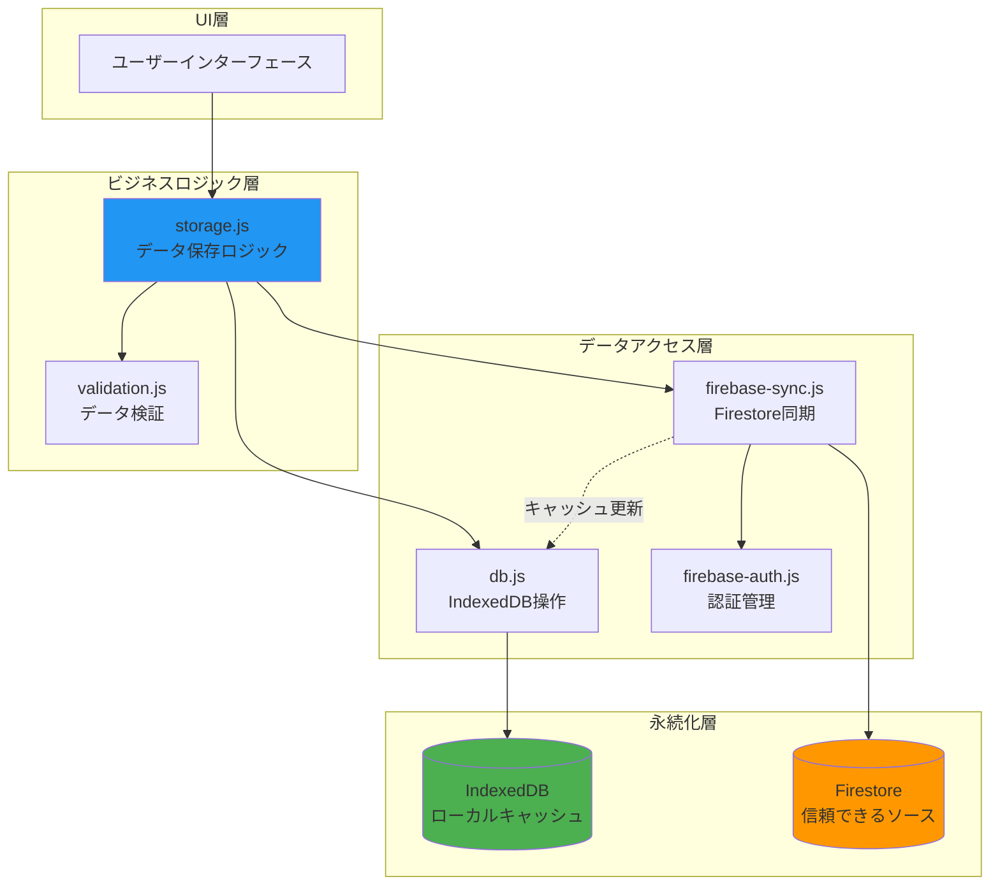

---

## クラス構造

### YieldCalculatorDB クラス

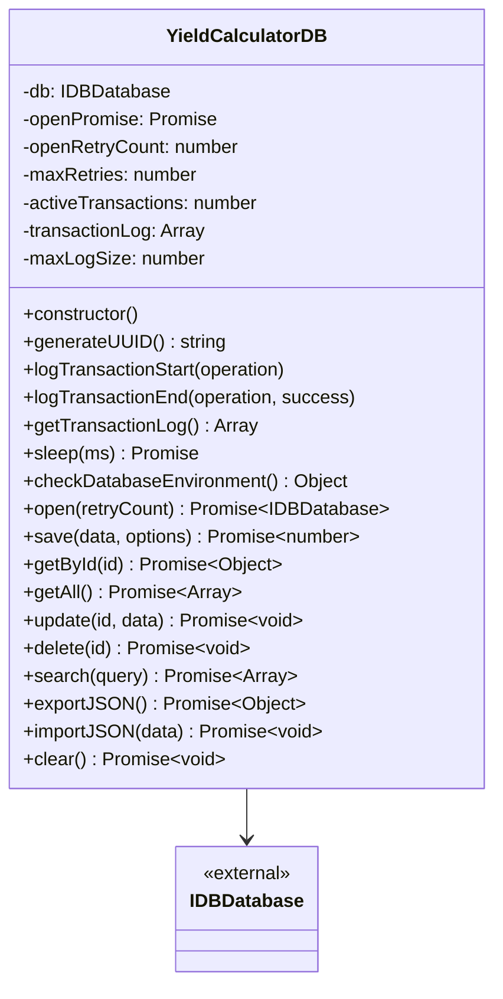

### データモデル

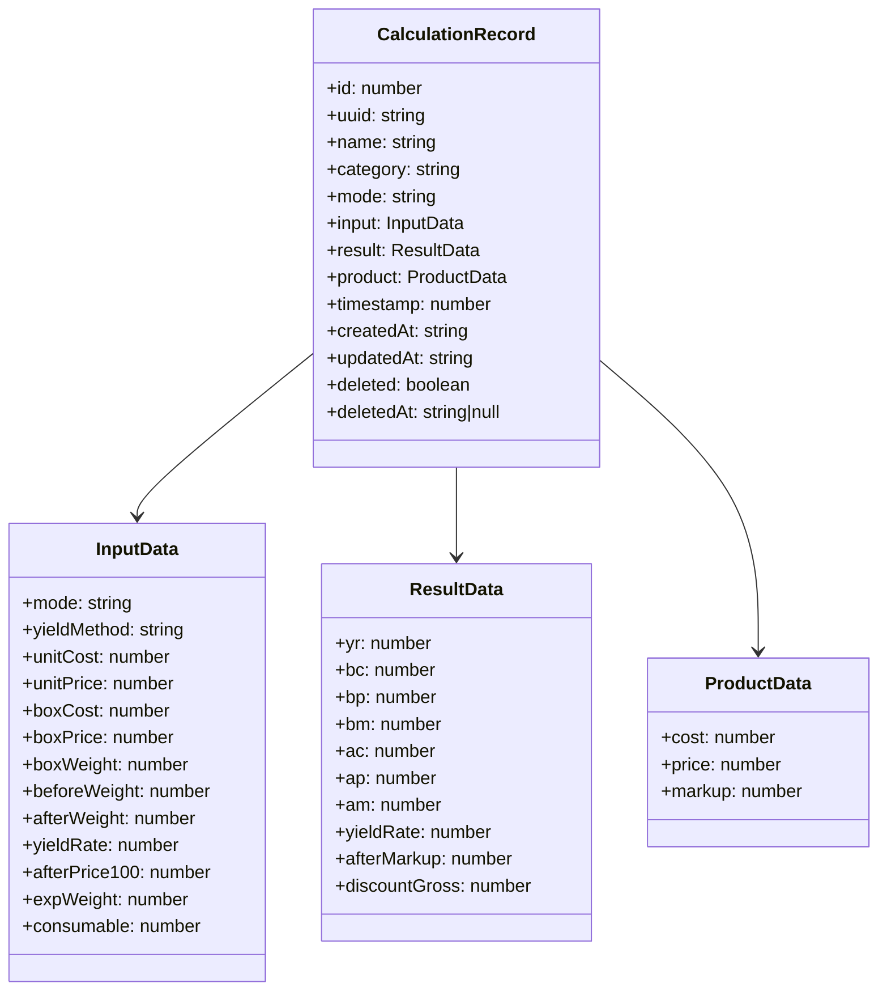

---

## Create（作成）

### 処理フロー

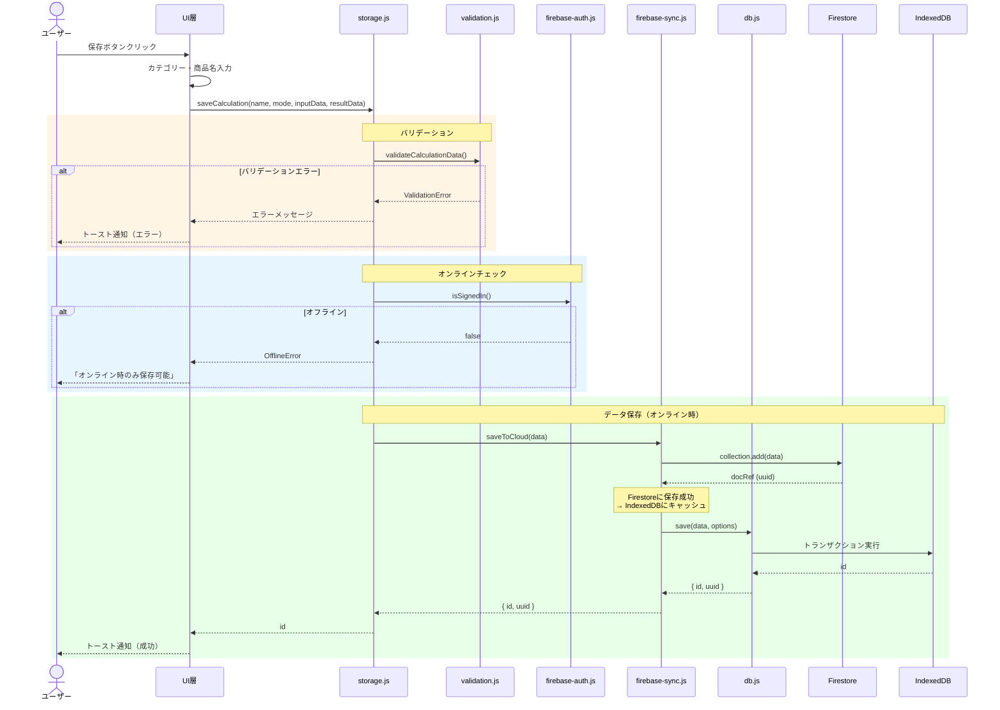

### 主要関数

#### storage.js: saveCalculation()

```javascript
/**
 * 現在の計算データを保存（オンライン時のみ）
 * ベストプラクティス：Firestoreに直接保存 → IndexedDBにキャッシュ
 */
export async function saveCalculation(name, mode, inputData, resultData, category = null, productData = null) {
  // 1. バリデーション
  validateCalculationData({ name, mode, input: inputData, result: resultData, category, productData });

  // 2. オンラインチェック
  if (!isSignedIn()) {
    throw new OfflineError('save');
  }

  // 3. データ準備
  const data = {
    name,
    mode,
    category,
    input: inputData,
    result: resultData,
    product: productData,
    timestamp: Date.now()
  };

  // 4. Firestoreに保存（IndexedDBにもキャッシュ）
  const result = await saveToCloud(data);
  return result.id;
}
```

#### db.js: save()

```javascript
/**
 * データを保存（IndexedDB）
 * @param {Object} data - 保存するデータ
 * @param {Object} options - { uuid: string } Firebase UUIDを含む
 * @returns {Promise<number>} 保存されたレコードのID
 */
async save(data, options = {}) {
  this.logTransactionStart('save');

  const db = await this.open();
  const transaction = db.transaction([STORE_NAME], 'readwrite');
  const store = transaction.objectStore(STORE_NAME);

  const record = {
    ...data,
    uuid: options.uuid || this.generateUUID(),
    timestamp: data.timestamp || Date.now(),
    createdAt: new Date().toISOString(),
    updatedAt: new Date().toISOString(),
    deleted: false,
    deletedAt: null
  };

  const request = store.add(record);

  return new Promise((resolve, reject) => {
    request.onsuccess = () => {
      this.logTransactionEnd('save', true);
      resolve(request.result); // IndexedDB ID
    };
    request.onerror = () => {
      this.logTransactionEnd('save', false);
      reject(createUserFriendlyError(request.error, 'データの保存'));
    };
  });
}
```

### データ整合性保証

| 項目 | 保証内容 |
|------|---------|
| **UUID** | Firestore ドキュメントIDとIndexedDB レコードを紐付け |
| **順序** | Firestore保存成功 → IndexedDBキャッシュ（Firestoreが信頼できるソース） |
| **競合** | 新規作成のため競合なし |
| **リトライ** | Firestore保存失敗時はIndexedDBにも保存しない |

---

## Read（読み込み）

### 処理フロー

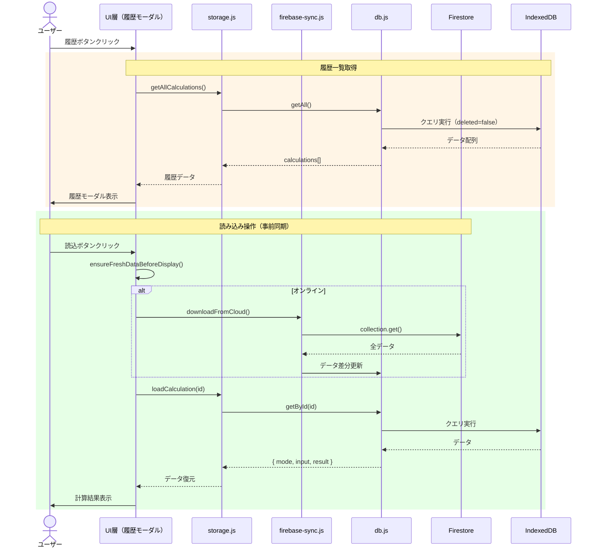

### 主要関数

#### storage.js: loadCalculation()

```javascript
/**
 * 保存済みのデータから入力値を復元
 *
 * キャッシュ整合性保証:
 * - handleLoadCalculation()内でFirestoreと同期済み（ensureFreshDataBeforeDisplay）
 * - モーダルを開いてから時間が経過している可能性を考慮し、読み込み直前に再同期
 */
export async function loadCalculation(id) {
  validateId(id);

  const data = await db.getById(id);
  if (!data) {
    throw new NotFoundError(id);
  }

  return {
    mode: data.mode,
    input: data.input,
    result: data.result,
    product: data.product,
    category: data.category
  };
}
```

#### db.js: getById()

```javascript
/**
 * IDでデータを取得
 * @param {number} id - レコードID
 * @returns {Promise<Object|null>}
 */
async getById(id) {
  this.logTransactionStart('getById');

  const db = await this.open();
  const transaction = db.transaction([STORE_NAME], 'readonly');
  const store = transaction.objectStore(STORE_NAME);
  const request = store.get(id);

  return new Promise((resolve, reject) => {
    request.onsuccess = () => {
      this.logTransactionEnd('getById', true);
      const record = request.result;

      // 削除済みレコードはnullを返す
      if (record && record.deleted) {
        resolve(null);
      } else {
        resolve(record);
      }
    };
    request.onerror = () => {
      this.logTransactionEnd('getById', false);
      reject(createUserFriendlyError(request.error, 'データの取得'));
    };
  });
}
```

### データ同期戦略

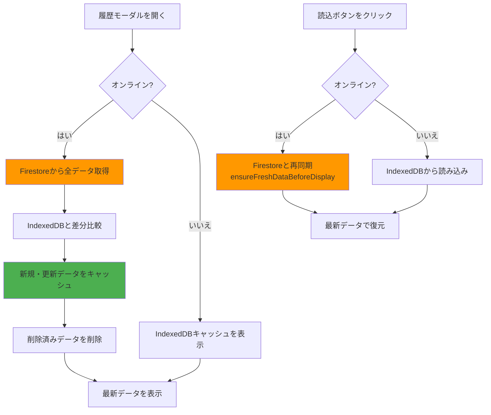

---

## Update（更新）

### 処理フロー

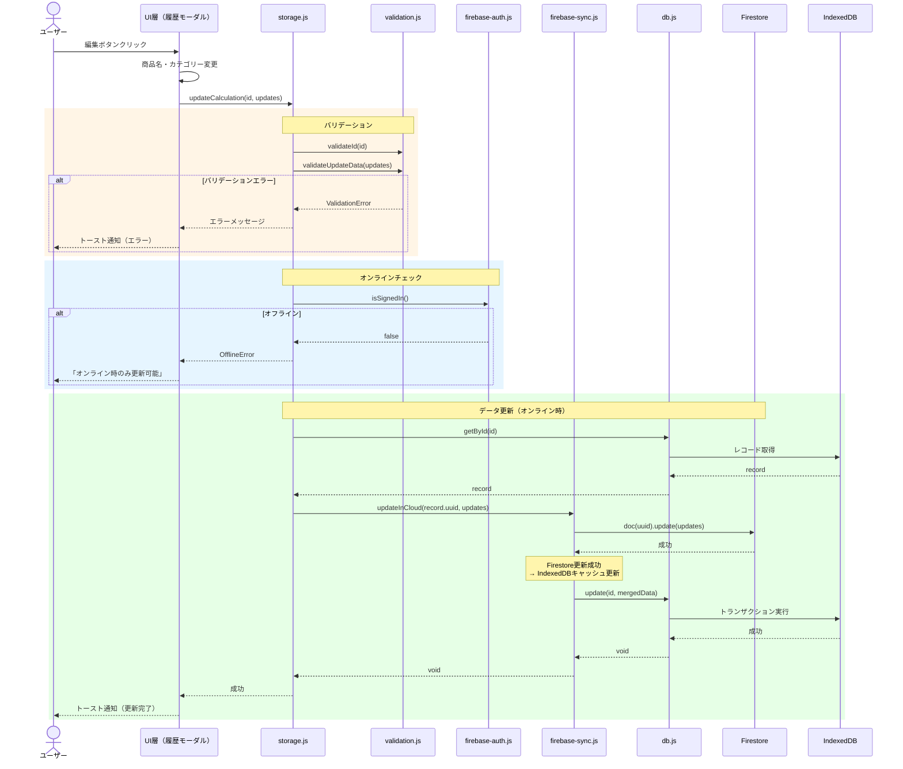

### 主要関数

#### storage.js: updateCalculation()

```javascript
/**
 * 保存済みデータを更新（オンライン時のみ）
 * ベストプラクティス：Firestoreを更新 → IndexedDBキャッシュを更新
 */
export async function updateCalculation(id, updates) {
  // 1. バリデーション
  validateId(id);
  validateUpdateData(updates);

  // 2. オンラインチェック
  if (!isSignedIn()) {
    throw new OfflineError('update');
  }

  // 3. 既存データ取得
  const existingData = await db.getById(id);
  if (!existingData) {
    throw new NotFoundError(id);
  }

  // 4. Firestoreを更新（IndexedDBキャッシュも更新）
  await updateInCloud(existingData.uuid, updates);
}
```

#### db.js: update()

```javascript
/**
 * データを更新
 * @param {number} id - レコードID
 * @param {Object} updates - 更新内容
 * @returns {Promise<void>}
 */
async update(id, updates) {
  this.logTransactionStart('update');

  const db = await this.open();
  const transaction = db.transaction([STORE_NAME], 'readwrite');
  const store = transaction.objectStore(STORE_NAME);

  // 既存データを取得
  const getRequest = store.get(id);

  return new Promise((resolve, reject) => {
    getRequest.onsuccess = () => {
      const record = getRequest.result;
      if (!record || record.deleted) {
        reject(createUserFriendlyError(new Error('Record not found'), 'データの更新'));
        return;
      }

      // データをマージして更新
      const updatedRecord = {
        ...record,
        ...updates,
        updatedAt: new Date().toISOString()
      };

      const putRequest = store.put(updatedRecord);
      putRequest.onsuccess = () => {
        this.logTransactionEnd('update', true);
        resolve();
      };
      putRequest.onerror = () => {
        this.logTransactionEnd('update', false);
        reject(createUserFriendlyError(putRequest.error, 'データの更新'));
      };
    };

    getRequest.onerror = () => {
      this.logTransactionEnd('update', false);
      reject(createUserFriendlyError(getRequest.error, 'データの取得'));
    };
  });
}
```

### データ整合性保証

| 項目 | 保証内容 |
|------|---------|
| **UUID照合** | IndexedDB IDからUUIDを取得し、Firestoreドキュメントを特定 |
| **順序** | Firestore更新成功 → IndexedDBキャッシュ更新（Firestoreが信頼できるソース） |
| **競合** | 楽観的ロック（Firestore Timestamp利用） |
| **ロールバック** | Firestore更新失敗時はIndexedDBを更新しない |

---

## Delete（削除）

### 処理フロー（論理削除）

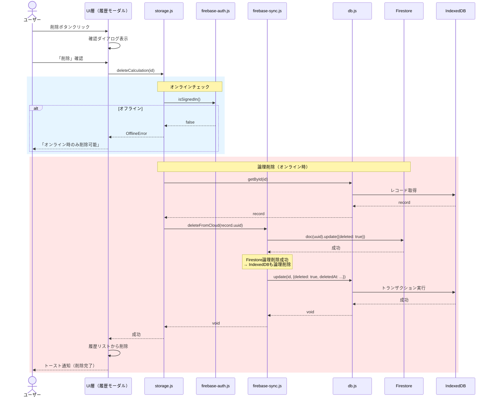

### 論理削除 vs 物理削除

| 方式 | メリット | デメリット | 採用状況 |
|------|---------|----------|---------|
| **論理削除** | - 復元可能<br/>- 監査証跡が残る<br/>- 同期が簡単 | - ストレージ増加<br/>- クエリが複雑 | ✅ **現在の実装** |
| **物理削除** | - ストレージ節約<br/>- クエリが単純 | - 復元不可<br/>- 同期が難しい | ❌ 未採用 |

### 主要関数

#### storage.js: deleteCalculation()

```javascript
/**
 * 保存済みデータを削除（オンライン時のみ）
 * ベストプラクティス：Firestoreで論理削除 → IndexedDBキャッシュも論理削除
 */
export async function deleteCalculation(id) {
  // 1. バリデーション
  validateId(id);

  // 2. オンラインチェック
  if (!isSignedIn()) {
    throw new OfflineError('delete');
  }

  // 3. 既存データ取得
  const existingData = await db.getById(id);
  if (!existingData) {
    throw new NotFoundError(id);
  }

  // 4. Firestoreで論理削除（IndexedDBキャッシュも更新）
  await deleteFromCloud(existingData.uuid);
}
```

#### db.js: update() （論理削除用）

```javascript
// deleteフラグを更新するためにupdate()を使用
await db.update(id, {
  deleted: true,
  deletedAt: new Date().toISOString()
});
```

### 全削除機能

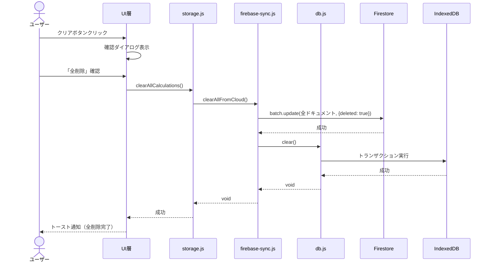

---

## エラーハンドリング

### エラー階層構造

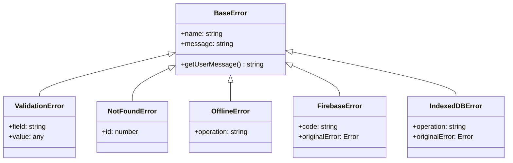

### エラーマッピング

#### IndexedDBエラー → ユーザーメッセージ

```javascript
function createUserFriendlyError(error, operation) {
  let message = `データベース操作に失敗しました: ${operation}`;

  if (error.name === 'QuotaExceededError') {
    message = 'ストレージの容量が不足しています。不要なデータを削除してください。';
  } else if (error.name === 'VersionError') {
    message = 'データベースのバージョンが競合しています。ページを再読み込みしてください。';
  } else if (error.name === 'InvalidStateError') {
    message = 'データベースが無効な状態です。ページを再読み込みしてください。';
  } else if (error.name === 'DataError') {
    message = 'データの形式が正しくありません。';
  } else if (error.name === 'AbortError') {
    message = 'データベース操作が中断されました。';
  }

  const userError = new Error(message);
  userError.originalError = error;
  userError.operation = operation;
  return userError;
}
```

#### Firebaseエラー → ユーザーメッセージ

| Firebaseエラーコード | ユーザーメッセージ |
|---------------------|------------------|
| `permission-denied` | アクセス権限がありません。ログインしてください。 |
| `not-found` | データが見つかりませんでした。 |
| `already-exists` | データが既に存在します。 |
| `resource-exhausted` | 操作の上限に達しました。しばらく待ってから再試行してください。 |
| `unauthenticated` | 認証が必要です。ログインしてください。 |
| `unavailable` | サービスが一時的に利用できません。しばらく待ってから再試行してください。 |

### エラー処理フロー

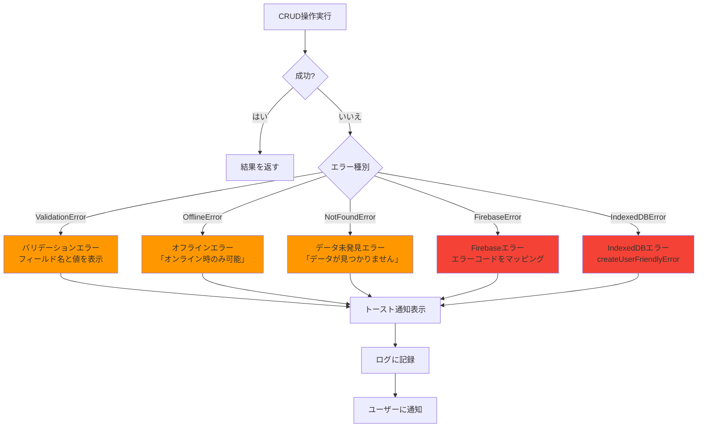

---

## データ同期戦略

### 同期タイミング

| イベント | 同期処理 | 理由 |
|---------|---------|------|
| **アプリ起動時** | Firestoreから全データ取得 → IndexedDB更新 | 最新状態を保証 |
| **履歴モーダルを開く** | ensureFreshDataBeforeDisplay() | モーダル表示前に同期 |
| **読込ボタンクリック** | ensureFreshDataBeforeDisplay() | 読み込み直前に再同期 |
| **保存/更新/削除後** | Firestore操作 → IndexedDBキャッシュ | 即座に反映 |
| **定期同期** | ❌ 未実装 | 将来的にバックグラウンド同期を検討 |

### 同期フロー詳細

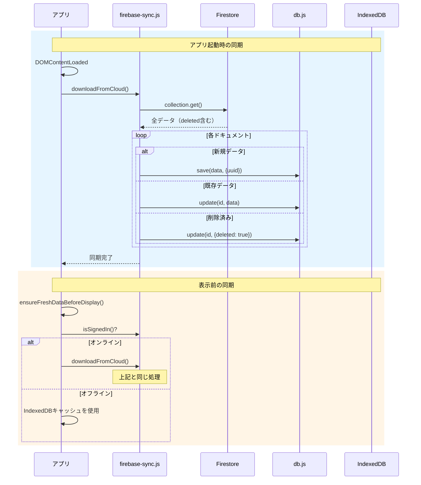

### 競合解決戦略

| 競合シナリオ | 解決方法 | 実装状況 |
|------------|---------|---------|
| **マルチデバイス同時編集** | Firestore Timestampで最終書き込み優先 | ✅ 実装済み |
| **オフライン中の編集** | オフライン編集を許可しない | ✅ 実装済み |
| **削除済みデータの復元** | 論理削除フラグで管理 | ✅ 実装済み |

---

## パフォーマンス最適化

### トランザクション管理（Safari対応）

```javascript
class YieldCalculatorDB {
  constructor() {
    this.activeTransactions = 0; // 同時実行トランザクション数
    this.transactionLog = []; // デバッグ用ログ
  }

  logTransactionStart(operation) {
    this.activeTransactions++;
    if (this.activeTransactions > 2) {
      console.warn(`⚠️ 複数トランザクション検出: ${this.activeTransactions}個同時実行中`);
    }
  }

  logTransactionEnd(operation, success = true) {
    this.activeTransactions = Math.max(0, this.activeTransactions - 1);
  }
}
```

### インデックス戦略

```javascript
// データベース初期化時にインデックスを作成
objectStore.createIndex('timestamp', 'timestamp', { unique: false });
objectStore.createIndex('name', 'name', { unique: false });
objectStore.createIndex('mode', 'mode', { unique: false });
objectStore.createIndex('category', 'category', { unique: false });
objectStore.createIndex('uuid', 'uuid', { unique: true });
objectStore.createIndex('deleted', 'deleted', { unique: false });
```

### クエリ最適化

```javascript
// ❌ 悪い例: 全データ取得後にフィルタリング
const allData = await db.getAll();
const activeData = allData.filter(item => !item.deleted);

// ✅ 良い例: インデックスを使用してフィルタリング
const activeData = await db.getAllActive(); // deleted=falseのみ取得
```

---

## セキュリティ

### データ検証

```javascript
// validation.js

export function validateCalculationData(data) {
  if (!data.name || data.name.trim() === '') {
    throw new ValidationError('name', data.name, '商品名は必須です');
  }

  if (!['fixed', 'weight'].includes(data.mode)) {
    throw new ValidationError('mode', data.mode, '無効な計算モードです');
  }

  // 入力データの型チェック
  if (typeof data.input.unitCost !== 'number' || data.input.unitCost < 0) {
    throw new ValidationError('unitCost', data.input.unitCost, '原価は0以上の数値である必要があります');
  }

  // ... その他のバリデーション
}
```

### アクセス制御

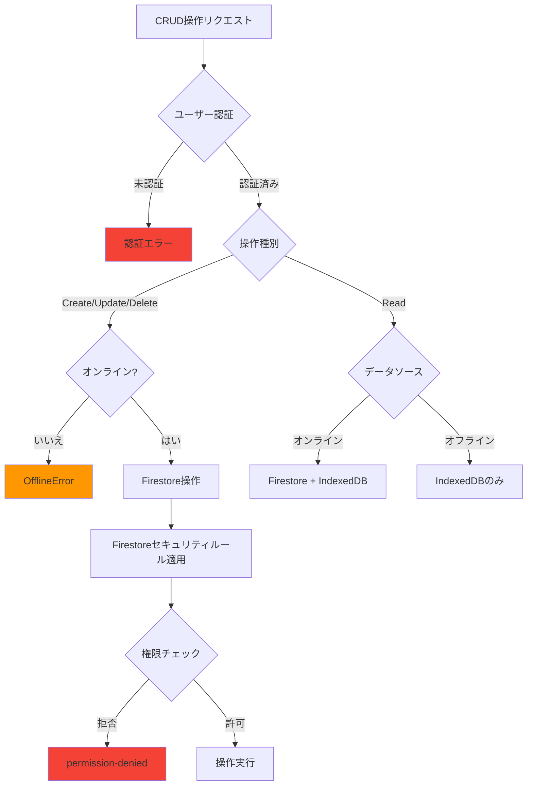

---

## まとめ

### CRUD操作の特徴

| 操作 | 主要戦略 | オフライン対応 |
|------|---------|--------------|
| **Create** | Firestore First | ❌ |
| **Read** | Cache First with Sync | ✅ |
| **Update** | Firestore First | ❌ |
| **Delete** | Firestore First（論理削除） | ❌ |

### 設計の強み

1. **Firestoreを信頼できるソース（Single Source of Truth）とする明確な方針**
2. **IndexedDBはキャッシュとして機能**
3. **論理削除による監査証跡の保持**
4. **ユーザーフレンドリーなエラーメッセージ**
5. **Safari対応のトランザクション管理**
6. **段階的な同期戦略（ensureFreshDataBeforeDisplay）**

### 今後の拡張可能性

- オフライン編集のサポート（ローカル変更キュー）
- 競合解決UIの実装
- バックグラウンド同期（Service Worker Sync API）
- データ圧縮（大量データ対応）
- 監査ログの可視化

---

**ドキュメント作成**: 2025-11-03
**バージョン**: v1.0
**作成者**: Claude Code
